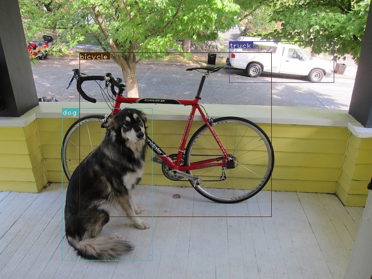
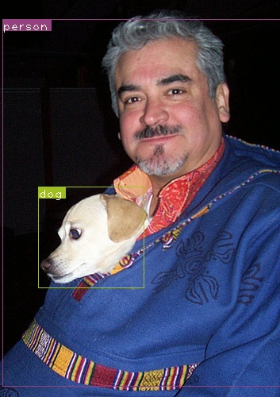

# YOLOv3 PyTorch Implementation

This repository contains a PyTorch implementation of YOLOv3, a popular object detection algorithm. The implementation is based on the [original paper](https://arxiv.org/abs/1804.02767) and the [official Darknet implementation](https://github.com/pjreddie/darknet).

## Installation
Clone this repository:
```bash
git clone https://github.com/your_username/your_repository.git
```

Install the required packages (preferrably in a [virtual environment](https://docs.python.org/3/library/venv.html)):
```
pip3 install -r requirements.txt
```

Download the YOLOv3 weights:
```
wget https://pjreddie.com/media/files/yolov3.weights -O weights/yolov3.weights
```

## Usage
To run the YOLOv3 detector on an image:
```bash
python3 detect.py --images imgs1 --det det
```

## Training
(coming soon...)

## Results
Here are some sample results from running the detector on the COCO dataset:




## References
- [YOLOv3 paper](https://arxiv.org/abs/1804.02767)
- [Official Darknet implementation](https://github.com/pjreddie/darknet)
- [@ayooshkathuria/pytorch-yolo-v3](https://github.com/ayooshkathuria/pytorch-yolo-v3)